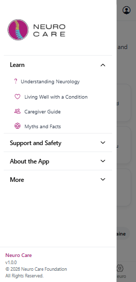
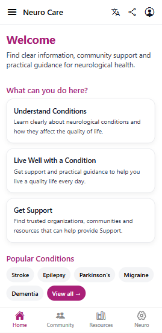
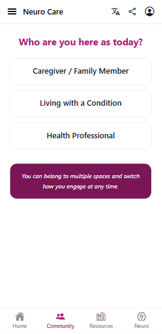
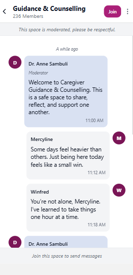
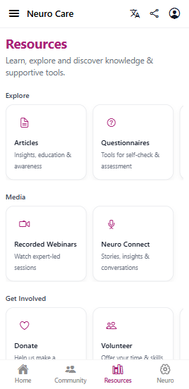
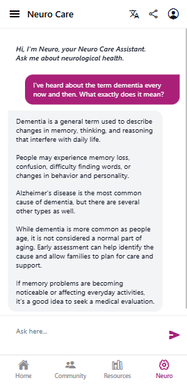

# Neuro Care App

Neuro Care is a mobile app designed to improve access to neurological knowledge, support communities and care resources.

The project was inspired by real challenges observed while working with organizations supporting persons with disabilities (PWDs), where families and caregivers often struggle to access reliable information, support networks and relevant programs.

## Purpose

The application aims to support individuals affected by neurological conditions, caregivers and the wider community by:

- Presenting trusted neurological health information.
- Surfacing organizational programs, events and resources.
- Moderated communities/spaces.
- Enabling guided assistance through an in-app AI assistant, termed Neuro.
- Supporting anonymous and authenticated user flows.

Instead of scattered resources across the internet, Neuro Care centralizes knowledge, support and services into a unified experience.

## Tech Stack

- React Native (Expo)
- TypeScript.
- Expo Router.
- Backend-driven navigation and configuration.
- Personalization.
- Internationalization and user preferences support.

## Architecture Overview

The frontend is built around **backend-authoritative contracts**, ensuring consistency and maintainability across the platform. Screens and navigation are derived from API responses rather than hardcoded assumptions.

Key principles:
- No screen exists without a corresponding backend contract.
- Navigation structure is stable and contract-driven.
- User identity supports both anonymous and authenticated states.
- Multi-language support is part of the core identity layer.
- Modular feature design
- Scalable community moderation tools

## Core Features

### Community Spaces

Moderated support spaces where caregivers, people with conditions, health professionals and the community at large can connect.

Features include:

- Joinable context-based spaces.
- Moderation tools.

### Neuro Assistant

An AI-powered assistant designed to answer neurological questions while grounding responses in both medical knowledge and verified organizational resources.

### Resource Directory

A structured directory of:

- Neurological support programs (articles, trainings, webinars, talks and podcasts).
- Events
- Organizations
- Getting involved opportunities (volunteering, donation and partnerships).

### Educational Content

Structured learning resources to help users better understand neurological conditions and care approaches.

## Screenshots

### Drawer

### Home

### Community

### Community Spaces

### Resources

### Neuro

## Project Status

This repository currently contains a working prototype demonstrating the core platform features including basic neurological health content, community spaces, moderation tools and the foundation for AI-assisted neurological support.

The long-term goal is to evolve Neuro Care into a scalable digital ecosystem supporting neurological care access globally.

Created and developed by [Joseph Onyango](https://github.com/aogajoseph)
